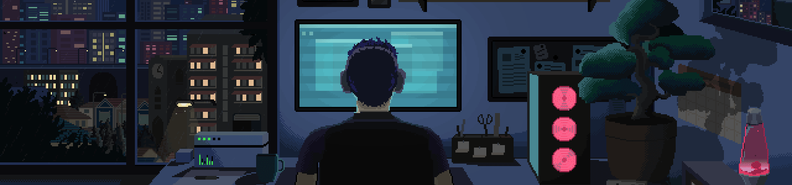

<h1 align="center" style="color:#FFBF00;">Hi, I'm David 🫡</h1>

  <b style="color:#FFBF00;">Junior Developer</b> · Focused on backend (Python, Java), with some frontend (TypeScript, React) and DevOps knowledge

---

<h2 style="color:#FFBF00;">
   
  About me
</h2>

  Recently graduated in Multiplatform Application Development (DAMD). I come from the VFX world, where I spent several years building FX tools with Houdini. Currently I'm looking to join a dev team where I can keep improving as a programmer.

  That background gives me a mix of technical problem-solving and visual thinking that I bring to every project.

<h2 style="color:#FFBF00;">
  
  Technologies That I Know
</h2>

  

<h2 style="color:#FFBF00;"> 
  
  Currently learning 
</h2>

- Production deployment (Postgres / Supabase, Render, Vercel)
- Testing and code quality
- Cloud fundamentals (AWS)

<h2 style="color:#FFBF00;">
   
  GitHub stats
</h2>

  
  

<h2 style="color:#FFBF00;">
  
  Contact 
</h2>

  
  

